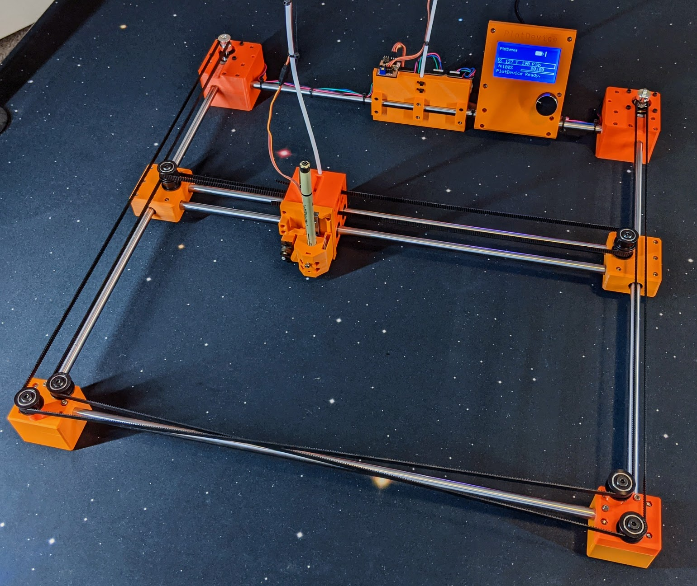

# PlotDevice
Super compact and simple CoreXY Plotter



The PlotDevice is designed to be as simple and cheap as possible without sacrificing quality and speed. While it can be setup with any controller that supports the CoreXY configuration, I have designed it with Marlin and TMC drivers in mind. This allows it to use sensorless homing and therefore making wiring a breeze. The motors are all stationary and you only need to run 3 wires for the servo to the tool head.

The core design calls for 500mm linear rods which results in a roughly 410mm x 350mm working area (depending on tool used). However, you could easily use any length rod to increase or shrink the overall machine size.

The total cost for the specified configuration should be around $300.

<video preload="auto" muted loop autoplay src="img/plot_device_anim.mp4"></video>

## 3D Printed Components

All the necessary CAD models can be found in the [CAD](/CAD) folder and are already oriented correctly for printing. This includes the full [Fusion 360 Design](/CAD/PlotDevice.f3z)

For the items listed as `xN_PartName.stl` note that you must print `N` copies of that item. 

### Print Settings

**PLEASE NOTE:** All components have been designed specifically with the given print settings in mind. There are features of the models that depend on these settings and may not print correctly if not followed.

All components should be printed in PLA with the following settings:

- 0.4mm nozzle diameter
- 0.2mm layer height
- 3 shells / 3 top & bottom lasers
- 25% Grid Infill
- Top & Bottom layers Rectilinear Infill
- NO SUPPORT. None of the components will require any support.

Any other settings would depend on your particular filament and printer capability but I recommend using high quality filament with consistent diameter. I are partial to Printed Solid, Atomic or Prusa brands.

Final word on quality and accuracy: The PlotDevice is designed with relatively tight tolerances so your prints need to be as accurate as possible. If you are unsure, I recommend printing this [calibration cube](https://www.thingiverse.com/thing:1586206) with the filament you want to use first as a test, with the above settings. If any dimension deviates from 20mm by more than 0.1mm, you should spend some time dialing in your extrusion settings for that filament until it is within 0.1mm tolerance.

## Bill of Materials

See the table below for the required components. Please note the following notes:

- The 10mm rods can be basically any length in order to achieve the desired working area. With 500 mm rods the working area will be roughly 410mm on X and 350mm on Y. Simply add or subtract from the 500mm length to change the working area by that size. Note however that the rods **must** be in matched sets.
    - The Y axis is only 2 rods.
    - The X axis requires 4 rods of the same length. 2 for the actual X axis gantry and 2 for the front and back of the frame.
- Limit switches are optional if you use a controller that supports sensorless homing.
- The specified controller will work with the provided Marlin firmware (see link in next section) but for another controller you will need to sort out the configuration yourself.
- 12V or 24V doesn't really matter, but 24V will generally be more responsive.
- Yes, I've specified a Hiwin linear rail for the pen lift. This is very much solving a problem with money and the one place I deviated from the basic ethos of the machine. With shipping expect it to cost $25-30 but I promise it's worth it. Note: ZYLTech will also custom cut MGN9 rails but they will be slightly more expensive than shipping it from RobotDigg in China.
- All nut and bolt counts are approximate and depend on what options you choose. It is highly recommend to purchase more than specified below by at least 15%.

|  Item | Qty | Vendor | Notes |
| --- | --- | --- | --- |
|  M3x25 | 40 | [Albany County Fasters](https://www.albanycountyfasteners.com/Socket-Head-Cap-Screw-3MM-A2-Stainless-Steel-p/5040000.htm "Albany County Fasters") |  |
|  M3x10 | 34 | [Albany County Fasters](https://www.albanycountyfasteners.com/Socket-Head-Cap-Screw-3MM-A2-Stainless-Steel-p/5040000.htm "Albany County Fasters") |  |
|  M3x5 | 8 | [Albany County Fasters](https://www.albanycountyfasteners.com/Socket-Head-Cap-Screw-3MM-A2-Stainless-Steel-p/5040000.htm "Albany County Fasters") |  |
|  M3 Nut | 82 | [Albany County Fasters](https://www.albanycountyfasteners.com/Socket-Head-Cap-Screw-3MM-A2-Stainless-Steel-p/5040000.htm "Albany County Fasters") |  |
|  M2x10 | 2 | [Albany County Fasters](https://www.albanycountyfasteners.com/Socket-Head-Cap-Screw-2MM-A2-Stainless-Steel-p/5020000.htm "Albany County Fasters") | 6 if using physical endstops |
|  M5x55 (low profile) | 6 | [Open Builds](https://openbuildspartstore.com/smooth-idler-pulley-kit/ "Open Builds") |  |
|  Idler Pulley Kit | 8 | [Open Builds](https://openbuildspartstore.com/smooth-idler-pulley-kit/ "Open Builds") | Technically only need the pulley body, 2x 625 bearings, lock nut, and washer from this kit. Could be purchased separately |
|  GT2 Timing Belt | 10 | [ZYLTech](http://www.zyltech.com/fiber-glass-reinforced-2gt-gt2-timing-belt-custom-length-price-per-meter/ "ZYLTech") | Two ~3m lengths needed. But best to have extra - but a full continuous 10m |
|  GT2 20T Pulley | 2 | [ZYLTech](http://www.zyltech.com/2gt-gt2-6mm-wide-20t-pulley-5mm-6-35mm-or-8mm-bore/ "ZYLTech") | MUST GET 5mm BORE VERSION!!! |
|  LM10UU Bearing | 4 | [ZYLTech](http://www.zyltech.com/lm10luu-linear-bearing-10mm-long/ "ZYLTech") | This is the long (55mm) version! |
|  10mm x 500mm Shaft | 6 | [ZYLTech](http://www.zyltech.com/10mm-chrome-plated-hardened-rod-shaft-pre-cut-lengths-300mm-1000mm/ "ZYLTech") | Be sure to select the 500mm option. |
|  Micro Limit Switch | 2 | [ZYLTech](http://www.zyltech.com/micro-switch-with-1-meter-wire-2a-125vac/ "ZYLTech") | **Optional if using sensorless homing |
|  MGN9 75mm Rail | 1 | [RobotDigg](https://www.robotdigg.com/product/671/HIWIN-Origin-Miniature-Guideway-Narrow-Linear-Rail "RobotDigg") | Be sure to select the **MGN9-1C-75** option |
|  9g Micro Servo | 1 | Various |  |
|  Nema 17 Stepper | 2 | [OMC](https://www.omc-stepperonline.com/index.php?route=product/isearch&search=17HS13-1334S "OMC") | Anything Bipolar around 30oz-in and shorter than 45mm should work. With 22+ mm 5mm bore shaft |
|  SKR Mini E3 v2.0 | 1 | [Various](https://www.amazon.com/gp/product/B0882QGFZR/ "Various") | v2.0 makes sensorless homing easier |
|  SKR Mini LCD | 1 | [Various](https://www.amazon.com/gp/product/B07NZ9SD26/ "Various") | **Optional |
|  12 or 24V @5A+ PSU | 1 | [Various](https://www.amazon.com/gp/product/B07PWZQ4MB/ "Various") |  |
|  SeroLaser | 1 | [Maniacal Labs](https://github.com/ManiacalLabs/ServoLaser) | Contact me if you want one |


## Controller

As noted above, any controller and firmware that supports CoreXY should work but sensorless homing would greatly simplify the design so I decided to try it out. Granted, Marlin is generally not a great option for non-3D printer applications but with a few tweaks it's possible to make it work well.

I've created a branch of the latest (as of v2.0.6) Marlin that has been configured for this machine and has the core code slightly modified to handle this application better:

- Added hard coded pen down / up delays to prevent movement starting before the pen is fully down or up.
- Removed Z homing so that a bare `G28` will not fail
- Configured the BLTouch output pins to work with the ServoLaser
- Configured to support M9 to suppress a warning from LightBurn generated gcode which always outputs M9 for Marlin.

You can find this updated code [here](https://github.com/adammhaile/Marlin/tree/PlotDevice) as well as a pre-compiled [firmware.bin in this repo](/firmware.bin).

With this configuration you can control the pen via the marlin "Laser" commands `M3` and `M5`. It's also configured so that anything other than a laser value of 0 will fully deploy the pen, so that:

```
M3 S255 ; pen down
M3 S10  ; also pen down
M3 S0   ; pen up
M5      ; pen up
```

Please note that this also all depends on using the [ServoLaser](https://github.com/ManiacalLabs/ServoLaser). This simple device merely reads the "laser" control signal (configured to output on the BLTouch deploy signal (`PA1`) pin) and converts that to a servo control signal. It provides automatic signal filtering so that you avoid fluttering as well as a built in trimpot that allows you to adjust the range and direction of motion.

The ServoLaser was originally intended to be sold by [Maniacal Labs](https://maniacallabs.com) but we decided to shut down the business before that happened. I do, however, have a couple dozen ServoLaser boards if anyone wants one. Just contact me via adammhaile [at] gmail [dot] com, and I can work out sending you one. Also, the device is not complicated and it would be relatively cheap to have the PCBs fabricated and buy the components - assuming you have the ability to flash the firmware on the ATTiny.

There's probably a way to make Marlin directly output servo signals, triggered by and `M` code but the intent of the ServoLaser was to avoid the need for doing something like that.

## Tool Holders

In the [Fusion 360 Design](/CAD/PlotDevice.f3z), under the `PenLift` component you will find several different pen holder options:

- `GenericPenHolder` - Designed to hold any pen up to 16mm in diameter.
- `PigmaMicronHolder` - Designed for genuine Pigma Micron felt tip "pens". They are amazing and highly recommend since you get get as small as 0.15mm tip diameter. This holder will hold them with a high degree of repeatability (for swapping colors). Knock-off Micron pens will likely not fit.
- `Stabilo88Holder` - Should work with the Stabilo 88 or similar.
- `FountainPen` - Mutli-part to hold a fountain pen (or similar) at an angle. Ensure your pen placement and angle will not cause it to crash into the frame!

All of these holders can be installed with two M3x5 screws (there are 4 holes but 2 on opposite corners works fine) into the MGN rail block. Just ensure it sits between the servo arm and the printed "spring" that's mounted to the pen lift face plate. This "spring" is simply to provide a little down pressure on the pen block, ensuring it doesn't bind in the up position. To that effect, each holder also has a open cavity on the right side - this is for two US nickels as extra weight. This both prevents rail binding as well as provides extra writing pressure on the pen.

But the sky is the limit here. You can use any of these as a starting point to design your own pen holder for *your* pen of choice.

## Build Notes

There will be no step-by-step guide provided. It would likely take me longer to assemble that than it did to design the machine in the first place. My recommendation is to download and load the provided Fusion 360 design and use that as a basic guide of what goes where. But please read through the following notes before beginning:

- All of the rods are held in place by compression from the 3D printed blocks they fit into and you need to make sure you get a tight fit. It the top (in terms of print orientation) is not perfectly flat and smooth you should smooth them out by running that face in a figure-eight pattern over some sand paper on a flat surface. Make sure you can place adjoinging printed parts against each other with no noticable gaps between them.
- Start by securing the 2 bearings in the X axis carriage then insert one rod into each of the bearings. Set aside.
- Place a bearing on each of the Y axis rods
- Pre-insert nuts into the `YRail` bottom parts and keep in place with some tape, if need be
- Set each of the `YRail` bottom parts on a flat surface and place the Y bearings in the recess, and then seat the X axis rods into the 2 slots.
- Place the top of the `YRail` components and secure everything with the M25 bolts. Make sure that the X axis rails are fully seated and square.
- At this point you can place the bottom section of the `Front` and `Motor` components on your builds surface and lay down the Y axis rods and front/back frame rods in the recesses. 
- Note that the front of the X carriage is the size where the bolts holding the bearings are recessed and there are mount holes for the pen mechanism.
- **BEFORE** putting the top of the `Front` components on, be sure to insert the four M5 lock nuts (flat side up) in each of the recesses. These should have come with the OpenBuilds Idler Pulley Kit.
- Before tightening the bolts fully on each corner, move the tool head around a bit and make sure everything runs smoothly and that it doesn't bind and any of the axis limits.
- Once the frame is built you can assembly the idler pulleys and secure them in place with the M5x55mm bolts. The pulleys on the `YRail` will also require an M5 lock nut.
- For the pulleys on the front corners, be sure that you get the correct placement with the standoffs in the correct placement. Refer to the design.
- When tightening the pulley bolts be sure not to overtighten. You want them just tight enough so that they can spin freely. This is why you must use lock nuts.
- Be **very** careful to study the belt pattern in the design before running the belts. Note that the black colored side of each belt in the design represents the side with teeth.
- For the 500mm rod design you will need over 2m of belt for each of the two runs. But I suggest having about 2.5m for each and cutting off the excess when done
- The `Tensioner` component is used both for tensioning and holding the other end of the belt. Start by inserting one end of the belt through the carriage block belt slow **without** a hole next to it, pull it through then slide the belt into the tensioner body. Make sure that the tensioner is inserted into the block with the belt slot open side up and the portion that holds the bolt facing inward.
- Run the belt around the pulleys and then pull the other end of the belt back through the block and through the belt slot with a hole on the same level as where the belt started.
- Pull the belt tight to get an idea of how much belt you need, and then pull it back out a little and insert the belt into a tensioner with a nut inserted. The pull the tensioner and belt back into the block and pass an M3x25mm bolt through the hole on the other side until it engages with the nut. You can then turn the bolt to tension the belt.
- Once this is done with both belts you want to make sure they are roughly the same level of tension. This is not easy so take your time. You made need to fully loosen and reseat the tensioner forward or back on the belt then tighten again.
- To ensure that the belts are of the right tension you can generally tell if the X axis is square to the frame and the belts provide a bit of resistance when pushing on them with one finger.
- You may need to tighten one side then the other until the axis is square *and* the belts are tight enough. During the process move around the tool head manually and make sure that everything still freely moves.
- Hooking up the motors can be a little finicky since there's no specific X or Y motor. Make sure that both motors are wired in the same wire order. Once connected if the tool head moves in the wrong direction or on the wrong axis you make need to either swap the motor connectors or rotate them 180 degrees in the same place. What will be right honestly depends entirely on the motors used.
- Depending on the length of the arms provided with your servo you may need to sand down the tip a little to make sure it doesn't bind up against the pen holder.